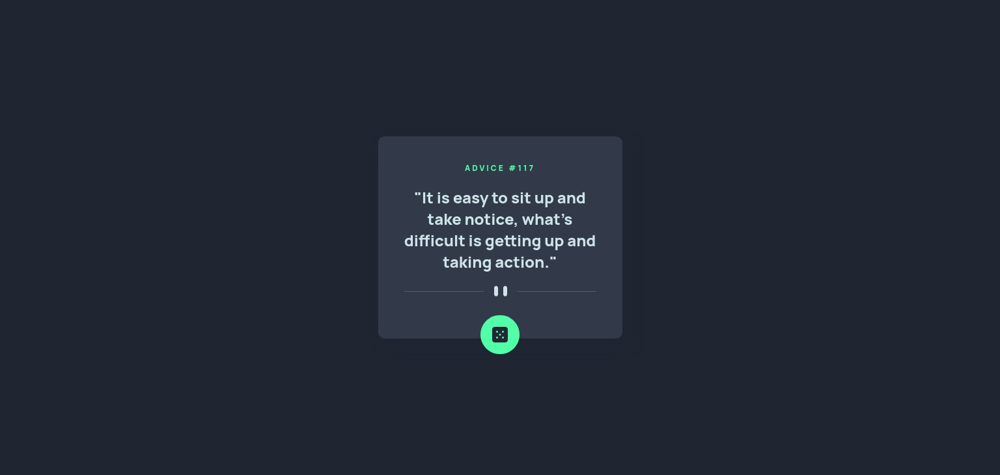

# Frontend Mentor - Advice generator app solution

This is a solution to the [Advice generator app challenge on Frontend Mentor](https://www.frontendmentor.io/challenges/advice-generator-app-QdUG-13db). Frontend Mentor challenges help you improve your coding skills by building realistic projects.

## Table of contents

- [Overview](#overview)
  - [The challenge](#the-challenge)
  - [Screenshot](#screenshot)
  - [Links](#links)
- [My process](#my-process)
  - [Built with](#built-with)
  - [What I learned](#what-i-learned)
  - [Useful resources](#useful-resources)
- [Author](#author)

## Overview
    Advice generator - VueJs
### The challenge

Users should be able to:

- 

### Screenshot

### Links

- Solution URL: (https://github.com/cazanca/advice-generator-vue)
- Live Site URL: (https://advice-generator-fdthwtv3i-cazanca.vercel.app/)

### Built with

- Semantic HTML5 markup
- CSS custom properties
- Flexbox
- Mobile-first workflow
- [Vue](vuejs.org/) - JS library

### Useful resources
- [Advice Slip API](https://api.adviceslip.com) 

## Author

- Frontend Mentor - [@cazanca](https://www.frontendmentor.io/profile/cazanca)
